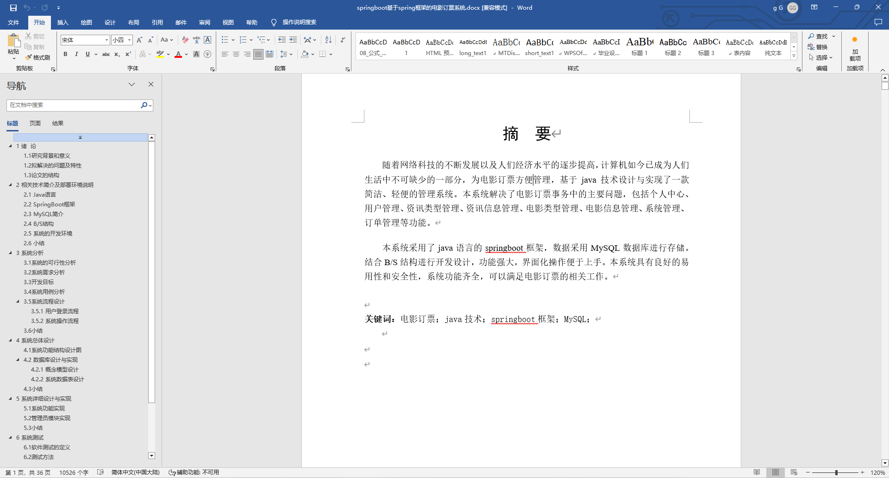
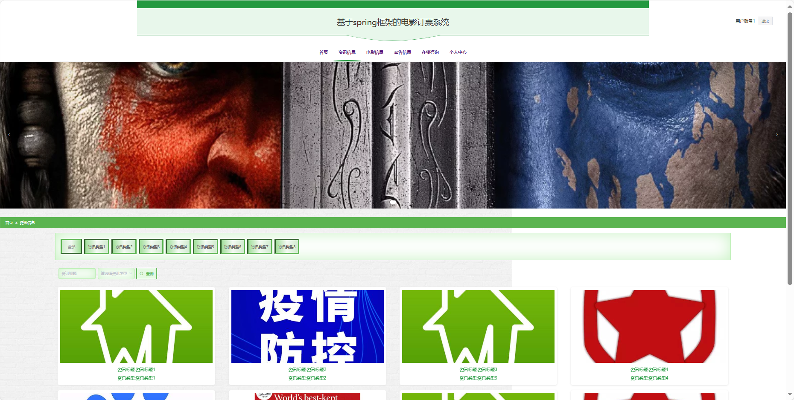
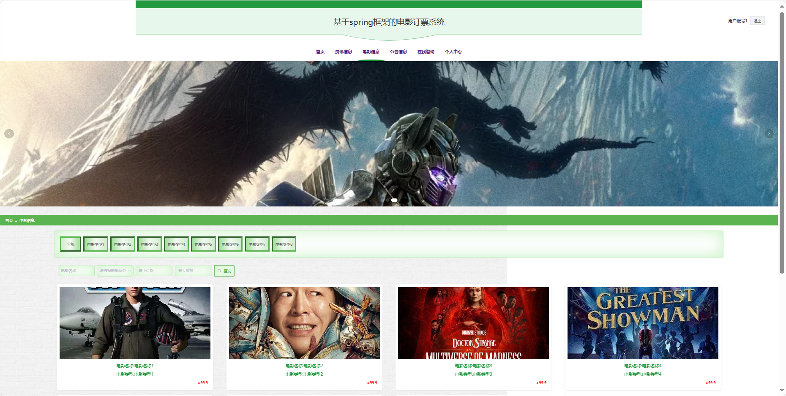
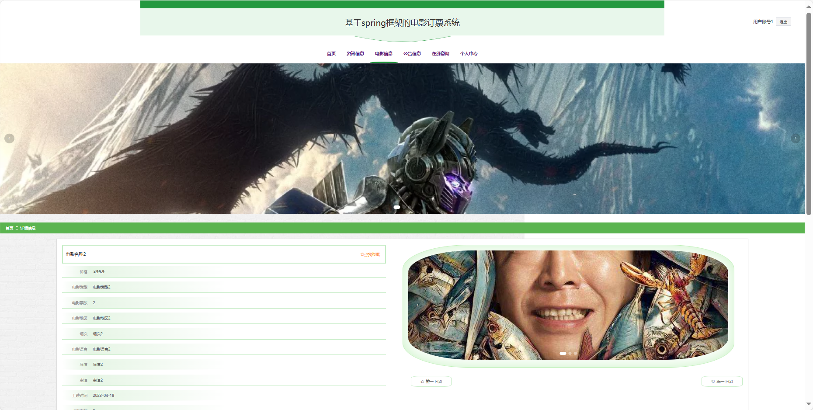
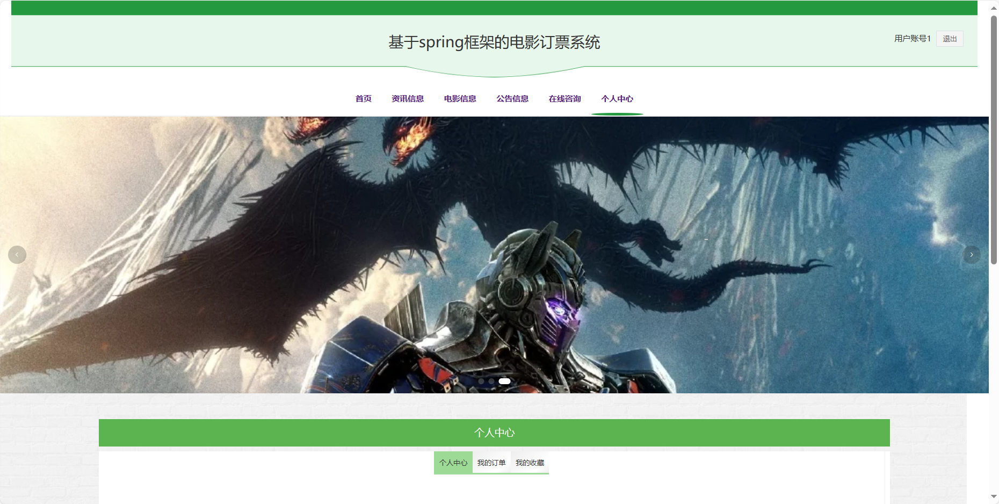
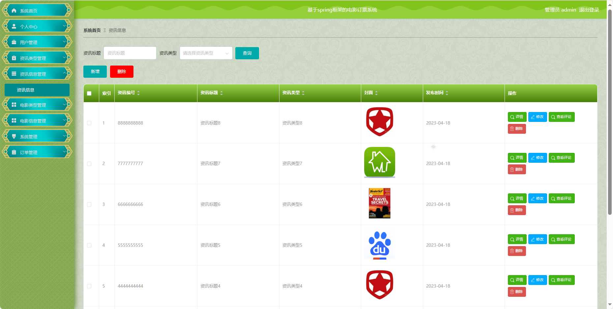
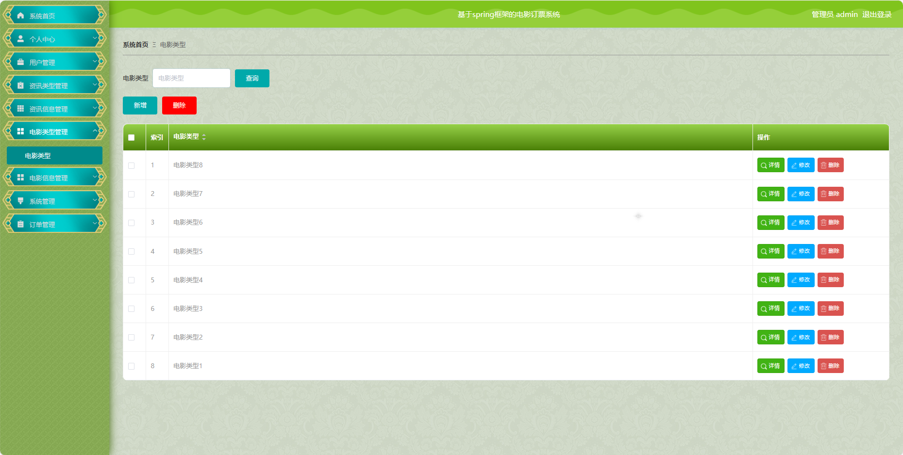

## 基于SpringBoot的电影订票系统(程序+报告)

- <b>完整代码获取地址：从戎源码网 ([https://armycodes.com/](https://armycodes.com/))</b>
- <b>技术探讨、资料分享，请加QQ群：692619798</b> 
- <b>作者微信：19941326836  QQ：952045282</b> 
- <b>承接计算机毕业设计、Java毕业设计、Python毕业设计、深度学习、机器学习</b>
- <b>选题+开题报告+任务书+程序定制+安装调试+论文+答辩ppt 一条龙服务</b>
- <b>所有选题地址 ([https://github.com/YuLin-Coder/AllProjectCatalog](https://github.com/YuLin-Coder/AllProjectCatalog)) </b>

## 项目介绍
基于SpringBoot的电影订票系统，系统包含两种角色：管理员、用户主要功能如下。

### 【管理员】:
系统首页：系统首页。
个人中心：管理管理员的个人信息。
用户管理：维护系统用户的账户信息。
资讯类型管理：管理电影资讯的分类。
资讯信息管理：发布、编辑和管理系统的资讯信息。
电影类型管理：管理电影的分类。
电影信息管理：发布、编辑和管理系统的电影信息。
系统管理：管理系统的基本设置。
订单管理：查看和管理用户的电影订票订单记录。

### 【用户】:
首页：浏览系统电影动态。
资讯信息：获取有关电影行业的新闻和资讯。
电影信息：查看电影的详细信息和排片情况。
公告信息：获取系统发布的重要公告。
在线咨询：与客服进行在线咨询和解答。
个人中心：管理个人信息和查看订单记录。

## 项目技术
- 编程语言：Java
- 数据库：MySQL
- 项目管理工具：Maven
- 前端技术：HTML、CSS、JavaScript、Jquery、Vue
- 后端技术：Spring、SpringMVC、MyBatis

## 运行环境
- JDK版本：JDK1.8及以上
- 开发工具：IDEA、Ecplise、Myecplise都可以
- 数据库: MySQL5.7及以上
- Maven：maven3.0及以上
- Node：14.14.0及以上

## 运行截图

